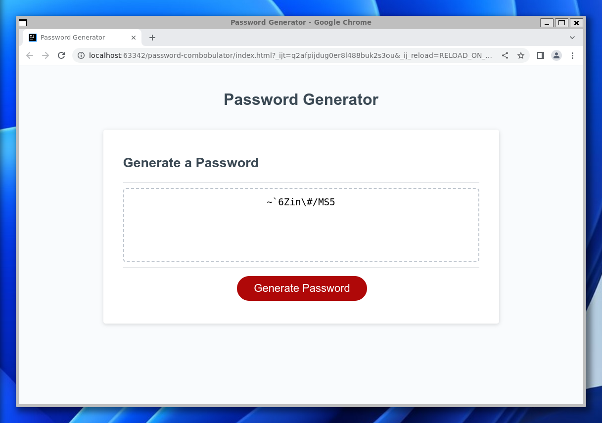

# Password Combobulator

combobulator
(Noun)

Any contraption that combobulates. Usually a far-flung contraption designed to perform a mysterious
process in order to manufacture an amazing or highly unusual product or outcome.

https://www.definition-of.com/Combobulator

This is the solution to the UC Berkeley Extensions coding boot camp module 3 challenge.
The challenge itself can be
found [here](https://courses.bootcampspot.com/courses/3826/assignments/57155?module_item_id=1005162)
and [here](https://git.bootcampcontent.com/University-of-California---Berkeley/UCB-VIRT-FSF-PT-06-2023-U-LOLC/-/tree/main/03-JavaScript/02-Challenge).

## Table of Contents

- [About](#about)
- [Getting Started](#getting-started)
- [Installing](#installing)
- [Usage](#usage)
- [Docs](#docs)
- [Screenshot](#screenshot)
- [Contributing](#contributing)

## About

The purpose of this challenge is to familiarize the student with the Javascript language by creating the code
to a supplied web page that generates random passwords based on user criteria.

## Getting Started

These instructions will get you a copy of the project up and running on your local machine for development and testing
purposes.

```bash
git clone git@github.com:srvidales/password-combobulator.git
```

## Installing

No installation required.

## Usage

In your favorite editor open the directory where you cloned the repo and locate the index.html file.
From the editor launch your favorite browser. Inspect the page with development tools as necessary.
Additionally, the repo is deployed to GitHub Pages.
It can be found here: https://github.com/srvidales/password-combobulator.

## Docs

Code documentation can be found here: https://srvidales.github.io/password-combobulator/docs/

## Screenshot

Screenshot can be found here: https://github.com/srvidales/password-combobulator/blob/main/screenshot.png



## Contributing

Sergio Vidales Perez <srvidales@gmail.com>
Xander Rapstine <xanderrapstine@gmail.com> (Starter code cloned from: https://github.com/coding-boot-camp/friendly-parakeet)